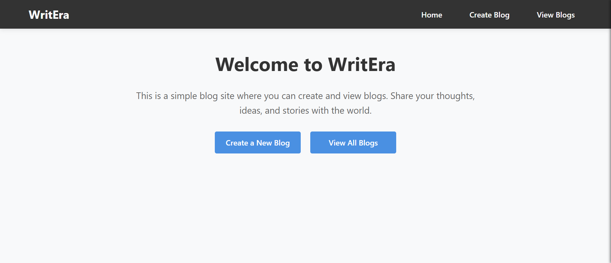
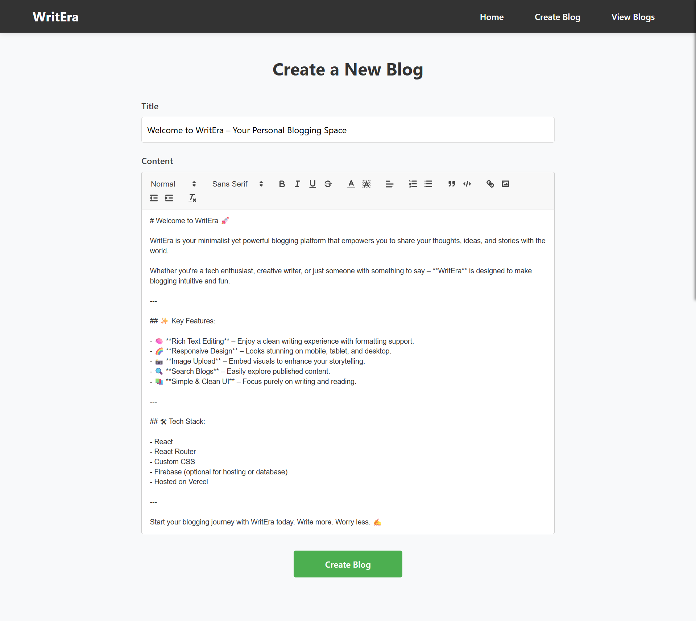
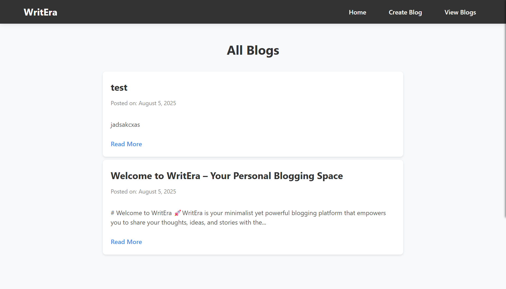
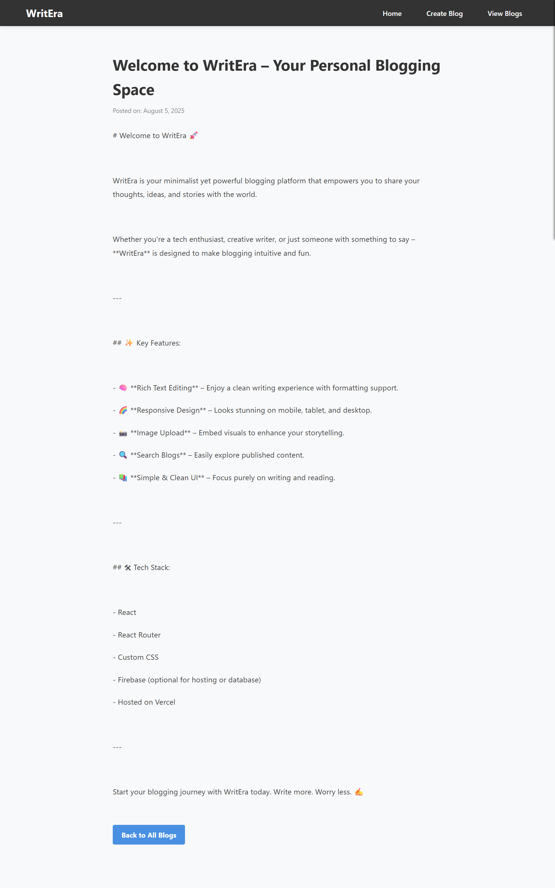
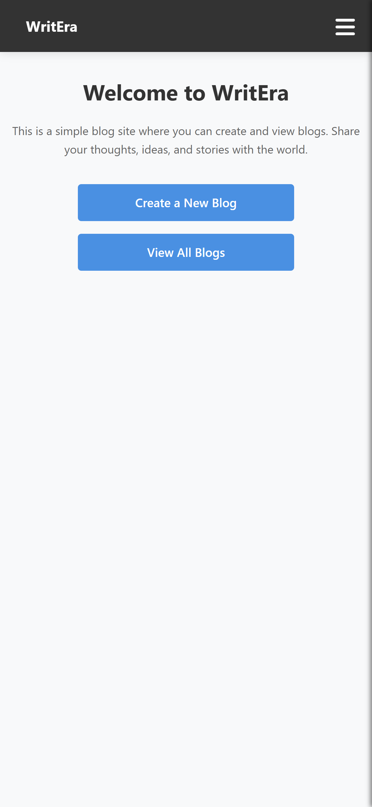
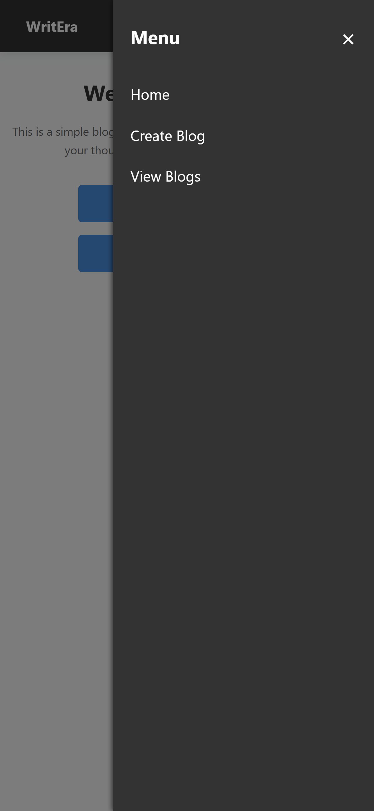
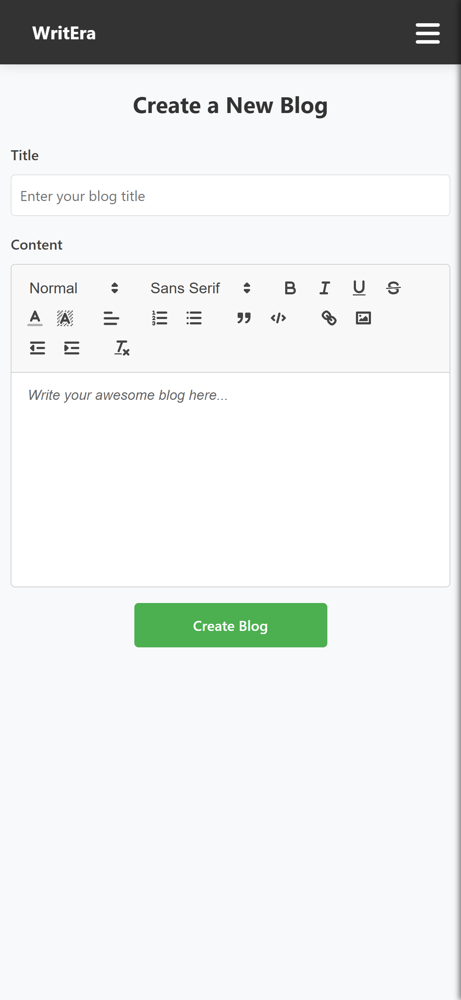
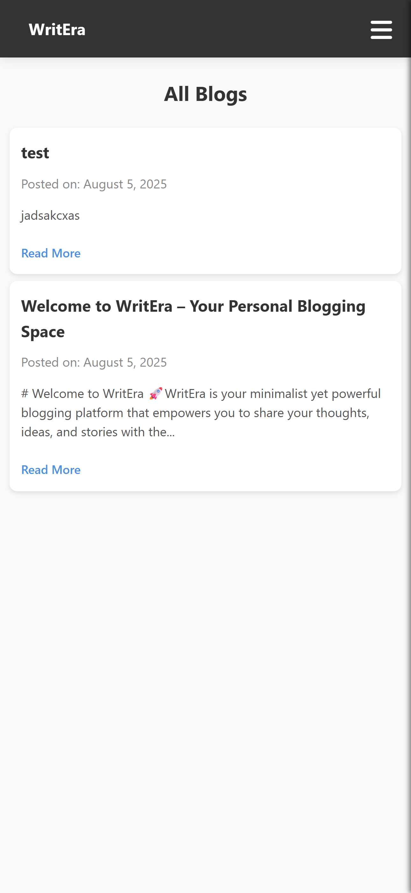
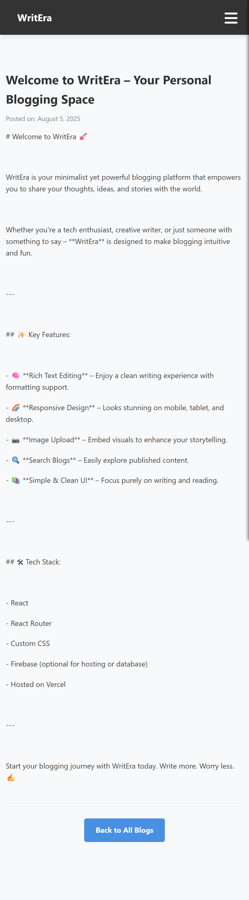

# ✍️ WritEra – A Modern Blogging Platform

WritEra is a clean, minimal, and fully responsive blogging web application that allows users to **create**, **view**, and **explore** blogs effortlessly. Built using React and styled with CSS, it provides a smooth user experience with an intuitive interface for writers and readers alike.

---

## 🚀 Live Demo

🌐 [View WritEra on Vercel](https://blogs-site-rm7vroqi2-bilal-ashrafs-projects-42c82465.vercel.app/)

---

## 📸 Screenshots For Desktop

| Home Page | Create Blog | View All Blogs | View Blogs |
|-----------|-------------|------------|----------------|
|  |  |  |  |

---

## 📸 Screenshots For Mobile

| Home Page | Sidebar | Create Blog | View All Blogs | View Blogs |
|-----------|---------|-------------|------------|----------------|
|  |  |  |  |  |

---

## ✨ Features

- ✅ Responsive Navbar with mobile sidebar toggle
- 📝 Rich-text blog creation
- 📚 Organized blog viewing page
- 🌓 Dark overlay for mobile menu for better focus
- ⚡ Smooth transitions and animations
- ☁️ Hosted on Vercel for fast, global access

---

## 🧑‍💻 Tech Stack

| Frontend | Routing | Styling | Deployment |
|----------|---------|---------|------------|
| React.js | React Router DOM | CSS3 | Vercel |

---

## 📂 Folder Structure

blogs-site/
├── public/
│ └── index.html
├── src/
│ ├── components/
│ │ └── Navbar.js
│ ├── pages/
│ │ ├── Home.js
│ │ ├── CreateBlog.js
│ │ └── ViewBlogs.js
│ │ └── BlogDetails.js
│ ├── styles/
│ │ └── Navbar.css
│ │ └── Home.css
│ │ └── CreateBlog.css
│ │ └── ViewBlogs.css
│ │ └── BlogDetails.css
│ ├── App.js
│ ├── index.js
│ ├── index.css
│ ├── App.css
├── README.md
└── package.json

---

## 🛠️ Installation & Setup

1. **Clone the repository**

   ```bash
   git clone https://github.com/mrbilalashraf/blogs-site.git
   cd blogs-site

2. **Install dependencies**

   ```bash
   npm install
   
3. **Run the application**

   ```bash
   npm start
   
4. **Open your browser and navigate to**

   ```bash
   http://localhost:3000
   
⚙️ Deployment on Vercel
1. Push your project to GitHub
2. Go to vercel.com
3. Import your GitHub repository
4. Configure build settings if needed

```bash
Framework: React
Build Command: npm run build
Output Directory: build
```

5. Deploy and enjoy your live app!

---

📌 TODO / Improvements
> 🔐 Add authentication (Login / Register)
> 🗃️ Store blogs in a database (e.g., Firebase or MongoDB)
> 💬 Enable commenting system
> 🖼️ Image upload support for blogs

🙌 Contributing
Want to contribute? Fork the repository and submit a PR with your improvements. For suggestions or issues, feel free to open a GitHub issue.

📄 License
This project is open source and available under the MIT License.

---

## 📝 Author

Bilal Ashraf

---

